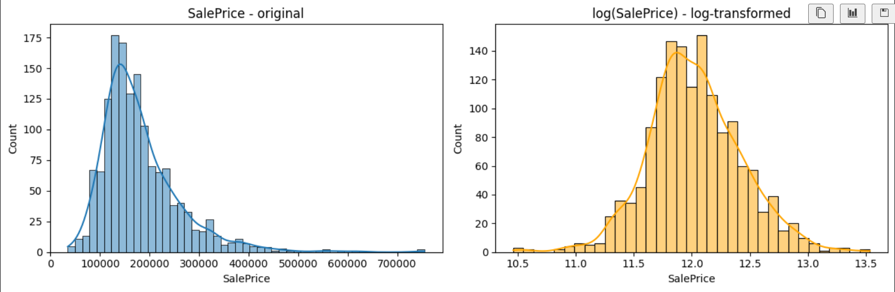

# House Prices Prediction

## Kaggle-ის კონკურსის მიმოხილვა
კონკურსის მიზანია ამერიკის ქალაქ Ames-ში სახლების გაყიდვის ფასების პრედიქცია 79 მახასიათებლის საფუძველზე. შეფასება ხდება RMSLE (Root Mean Squared Log Error) მეტრიკით.

## ჩემი მიდგომა
პრობლემის გადასაჭრელად გავიარე შემდეგი ეტაპები: EDA → Cleaning → Feature Engineering → Feature Selection → Training → Tuning. ყველა გადაწყვეტილება მონაცემებზე დაყრდნობით მივიღე, ყველა ექსპერიმენტი MLflow-ზე დავალოგე.

## რეპოზიტორიის სტრუქტურა
```
house-prices/
├── data/
│   ├── train.csv         # სასწავლო მონაცემები
│   └── test.csv          # სატესტო მონაცემები
├── model_experiment.ipynb  # ყველა ექსპერიმენტი
├── model_inference.ipynb   # პროგნოზი და submission
├── submission.csv          # Kaggle submission
└── README.md
```

---

## Data Analysis

### SalePrice განაწილება
სახლების ფასები ძლიერ გადახრილია მარჯვნივ (skewness = 1.88). ეს ნიშნავს რომ ბევრი იაფი სახლია და ცოტა ძვირი. ეს კი პრობლემაა მოდელისთვის _ ძვირი სახლების ცდომილება ($500,000 vs $1,000,000) ბევრად დიდია ვიდრე იაფი სახლების, და მოდელი ამ დიდ ცდომილებების შემცირებას ცდილობს, სხვა სახლებს კი ივიწყებს.

ამის გამოსასწორებლად შეგვიძლია გამოვიყენოთ log1p ტრანსფორმაცია:
- skewness-ის ცვლილება 1.88 → 0.12
- მოდელი log(SalePrice)-ზე ისწავლის
- პროგნოზის დროს expm1()-ს გამოვიყენებთ (log-ის საპირისპირო)
- ეს ასევე შეესაბამება Kaggle-ის RMSLE მეტრიკას


### Outlier ანალიზი
მონაცემტა ანალიზისას შემოწმდა მხოლოდ ის მახასიაბლები, რომელთაც არ ჰქონდათ ზედა ზღვარი(კატეგორიული ცვლადებსა და კონკრეტული რეინჯის მქონე ცვლადებს ამ ეტაპზე არ ვითვალისწინებთ), გამოვლინდა outlier-ები:
- **GrLivArea:** 2 სახლი >4000 sqft-ია მაგრამ დაბალი ფასი აქვს 
- **LotArea:** რამდენიმე სახლს ძალიან დიდი ეზო აქვს 
- **TotalBsmtSF:** ერთ სახლს >6000 sqft სარდაფი აქვს 

### Mean vs Median — სად Mean ცუდია?
outlier-ები Mean-ს ამახინჯებს. მაგალითად თუ 10 სახლს $200,000 ღირს და ერთს $2,000,000, Mean გაიზრდება და არარეალური გახდება. Median კი outlier-ებზე გავლენას არ ცნობს. ამიტომ EDA-ში გამოვთვალეთ სად არის Mean და Median შორის დიდი სხვაობა — ამ სვეტებში Median გამოვიყენეთ შევსებისთვის.

---

## Data Cleaning

### რატომ ამ სვეტებს ვშლით?
`PoolQC` (99.5%), `MiscFeature` (96.3%), `Alley` (93.8%), `Fence` (80.7%) — ამ სვეტებში მონაცემების 80-99% ცარიელია. Mode-ით ან Median-ით შევსება არარეალური იქნება — თითქმის ყველა სახლს ეს feature არ აქვს, შევსება კი ყალბ ინფორმაციას შექმნის.

### მიდგომა 1 — Naive Cleaning
ყველა ცარიელი რიცხვითი → median, ყველა კატეგორიული → mode. არაფერი არ წაიშლება.
- **შედეგი:** Shape (1460, 81)
- **პრობლემა:** PoolQC (99.5% ცარიელი) mode-ით შეივსო — 1453 სახლში ეს სვეტი ცარიელია, mode სრულიად არარეალური მნიშვნელობაა. მოდელი ამ ყალბ ინფორმაციას ისწავლის.

### მიდგომა 2 — Drop 80%+ + Global Median/Mode
80%+ ცარიელი სვეტები წაიშლება, დანარჩენი global median/mode-ით შეივსება.
- **შედეგი:** Shape (1460, 77), 4 სვეტი წაიშალა
- **LotFrontage:** global median-ით შეივსო — კარგია, მაგრამ შეიძლება უკეთესიც ვქნათ

### მიდგომა 3 — Smart Cleaning ✅ საუკეთესო
80%+ სვეტები წაიშლება. **LotFrontage** შეივსება Neighborhood-ის median-ით (და არა global median-ით). მიზეზი: ერთი უბნის სახლებს მსგავსი ქუჩის სიგრძე აქვთ — ეს გაცილებით რეალური დაშვებაა. დანარჩენი numeric → median, categorical → mode.
- **შედეგი:** Shape (1460, 77), Missing values: 0
- **უპირატესობა:** LotFrontage-ის შევსება კონტექსტზეა დაფუძნებული

---

## Feature Engineering

### კატეგორიული ცვლადების რიცხვითში გადაყვანა

მონაცემებში 39 კატეგორიული სვეტია (ტექსტი). მოდელი ვერ მუშაობს ტექსტზე — გადაყვანა აუცილებელია.

#### მიდგომა 1 — Label Encoding
თითოეულ კატეგორიას მიენიჭება რიცხვი: `CollgCr=0`, `Veenker=1`, `Crawfor=2`
- **შედეგი:** Shape (1460, 77) — სვეტების რაოდენობა არ შეიცვლება
- **უპირატესობა:** ხის მოდელებისთვის კარგია. ხის მოდელი split-ებს ირჩევს (მაგ: Neighborhood > 5?), ამიტომ რიცხვების "სიდიდე" მნიშვნელობას არ ცვლის
- **ნაკლი:** Linear მოდელებისთვის ცუდია — ისინი ფიქრობენ რომ `Crawfor=2` ორჯერ "დიდია" ვიდრე `CollgCr=0`

#### მიდგომა 2 — One-Hot Encoding
თითოეული კატეგორია ხდება ცალკე 0/1 სვეტი.
- **შედეგი:** Shape (1460, 287) — 77-დან 287-მდე (+210 სვეტი!)
- **უპირატესობა:** Linear მოდელებისთვის კარგია, კატეგორიებს შორის ყალბი კავშირი არ იქმნება
- **ნაკლი:** 210 ახალი სვეტი, რომელთა უმეტესობა 0-ია (sparse matrix). ეს ხმაურია მოდელისთვის და overfitting-ის რისკს ზრდის

#### გადაწყვეტილება: Label Encoding ✅
ჩვენ ხის მოდელებს ვიყენებთ (RandomForest, XGBoost, GradientBoosting, LightGBM). ამ მოდელებისთვის Label Encoding სრულიად საკმარისია. OHE-ს 287 სვეტი ხმაურია და overfitting-ს გამოიწვევს.

### NaN მნიშვნელობების დამუშავება
აღწერილია Data Cleaning სექციაში ზემოთ.

---

## Feature Selection

ყველა feature თანაბრად სასარგებლო არ არის. ვნახოთ რომელია მნიშვნელოვანი.

### მიდგომა 1 — ყველა Feature (75)
ყველა feature შეუფილტრავად.
- **შედეგი:** 75 feature
- **პრობლემა:** ბევრი სუსტი feature ხმაურს მატებს მოდელს და შედეგს აუარესებს

### მიდგომა 2 — Correlation Based Selection (25)
შეირჩა features რომელთაც SalePrice-თან |კორელაცია| > 0.3 ჰქონდათ.
- **შედეგი:** 25 feature
- **Top features:** `OverallQual`, `GrLivArea`, `GarageCars`, `ExterQual`, `GarageArea`
- **პრობლემა:** კორელაცია მხოლოდ **წრფივ** კავშირს ზომავს. თუ feature-ს SalePrice-თან არაწრფივი კავშირი აქვს, კორელაცია დაბალი იქნება, მაგრამ feature მაინც მნიშვნელოვანია

### მიდგომა 3 — Random Forest Importance top 15 ✅ საუკეთესო
Random Forest მოდელით განვსაზღვრეთ რომელი feature რამდენად ამცირებს შეცდომას.
- **შედეგი:** 15 feature
- **Top features:** `OverallQual`, `GrLivArea`, `TotalBsmtSF`, `GarageCars`, `GarageArea`, `1stFlrSF`, `BsmtFinSF1`, `YearBuilt`, `CentralAir`, `OverallCond`, `LotArea`, `GarageType`, `YearRemodAdd`, `MSZoning`, `GarageYrBlt`
- **უპირატესობა:** მოდელზე დაფუძნებული შერჩევა — **არაწრფივ** კავშირებსაც ითვალისწინებს

---

## Training

გავტესტე 14 სხვადასხვა მოდელი RF top 15 features-ზე. ყველა run დავალოგე MLflow-ზე: `cv_rmse`, `train_rmse`, `cv_std`, `overfit_gap`.

**overfit_gap = cv_rmse - train_rmse:**
- დიდი gap → overfit (მოდელი სასწავლო მონაცემებს ზეპირად იმახსოვრებს)
- პატარა gap მაგრამ cv_rmse მაღალი → underfit (მოდელი ვერ სწავლობს)
- ბალანსი → კარგი მოდელი

### Underfitting მოდელები
| მოდელი | CV RMSE | Train RMSE | Gap | მიზეზი |
|--------|---------|------------|-----|---------|
| LinearRegression | 0.1594 | 0.1536 | 0.0058 | ვერ პოულობს არაწრფივ კავშირებს |
| Ridge | 0.1594 | 0.1536 | 0.0058 | LinearRegression + regularization, იგივე პრობლემა |
| Lasso | 0.1595 | 0.1537 | 0.0058 | ზოგ feature-ს ნულამდე ამცირებს, კარგავს ინფორმაციას |
| ElasticNet | 0.1594 | 0.1536 | 0.0058 | Ridge + Lasso კომბინაცია, მაინც underfit |
| BayesianRidge | 0.1594 | 0.1536 | 0.0058 | Bayesian მიდგომა, Linear კავშირი |
| DecisionTree (depth=2) | 0.2538 | 0.2480 | 0.0057 | ძალიან ზედაპირული ხე — ვერ სწავლობს |

**რატომ underfitting:** სახლის ფასი რთული, არაწრფივი კავშირებზეა დამოკიდებული. Linear მოდელები მხოლოდ წრფივ კავშირებს ხედავენ. DecisionTree depth=2-ით ძალიან მარტივია.

### Overfitting მოდელები
| მოდელი | CV RMSE | Train RMSE | Gap | მიზეზი |
|--------|---------|------------|-----|---------|
| DecisionTree (no limit) | 0.2046 | 0.0018 | 0.2028 | ზეპირად იმახსოვრებს ყველა სახლს |
| ExtraTrees | 0.1384 | 0.0018 | 0.1366 | Random splits — ზეპირად იმახსოვრებს |
| RandomForest | 0.1435 | 0.0530 | 0.0905 | ბევრი ხე, შეზღუდვა არ არის |
| XGBoost | 0.1342 | 0.0419 | 0.0923 | ბევრი iteration, overfits |

**რატომ overfitting:** DecisionTree შეზღუდვის გარეშე ქმნის ისეთ ხეს სადაც ყველა სასწავლო მაგალითი ცალკე "ფოთოლია" — Train RMSE=0.0018 ნიშნავს სახლი სახლს ზეპირად. ახალ მონაცემებზე კი ვერ მუშაობს.

### ბალანსური მოდელები ✅
| მოდელი | CV RMSE | Train RMSE | Gap |
|--------|---------|------------|-----|
| SVR | 0.1379 | 0.0969 | 0.0410 |
| GradientBoosting | 0.1296 | 0.0934 | 0.0363 |
| LightGBM | 0.1360 | 0.0610 | 0.0751 |

---

## Hyperparameter Tuning

GradientBoosting-ზე გავატარე GridSearchCV 27 კომბინაციით (5-fold = 135 fit):
```
n_estimators: [100, 200, 300]
learning_rate: [0.01, 0.05, 0.1]
max_depth: [3, 4, 5]
```

**საუკეთესო პარამეტრები:** n_estimators=200, learning_rate=0.05, max_depth=4

**შედეგი:** CV RMSE გაუმჯობესდა 0.1296 → **0.1279**

### საბოლოო მოდელის შერჩევის დასაბუთება
**GradientBoosting** შეირჩა რადგან:
1. ყველაზე დაბალი CV RMSE: **0.1279**
2. Gap გონივრულია: **0.0529** — არ არის overfit
3. Boosting თანმიმდევრულად სწავლობს შეცდომებიდან — კარგად ბალანსირებული
4. Linear მოდელებზე ბევრად უკეთესი (0.1279 vs 0.1594)
5. DecisionTree-ზე ბევრად სტაბილური (gap 0.05 vs 0.20)

---

## MLflow Tracking

### MLflow ექსპერიმენტების ბმული
[https://dagshub.com/aband21/house-prices.mlflow](https://dagshub.com/aband21/house-prices.mlflow)

### ჩაწერილი მეტრიკები თითოეული run-ისთვის
- `cv_rmse` — cross-validation RMSE (5-fold) — მთავარი მეტრიკა
- `cv_std` — CV RMSE-ის სტანდარტული გადახრა (სტაბილურობის მაჩვენებელი)
- `train_rmse` — სასწავლო მონაცემებზე RMSE
- `overfit_gap` — cv_rmse - train_rmse (overfitting-ის მაჩვენებელი)

### საუკეთესო მოდელის შედეგები
- **მოდელი:** GradientBoosting (tuned)
- **CV RMSE:** 0.1279
- **Train RMSE:** 0.075
- **Model Registry:** house-prices-best-model, version 1
