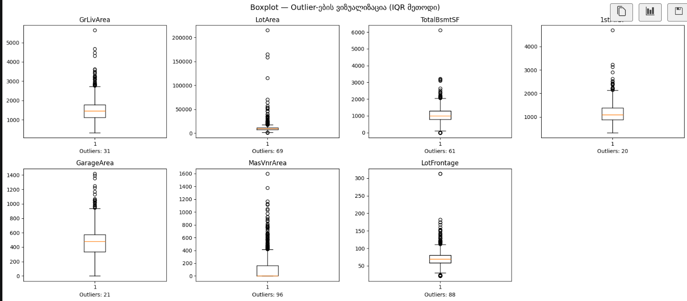
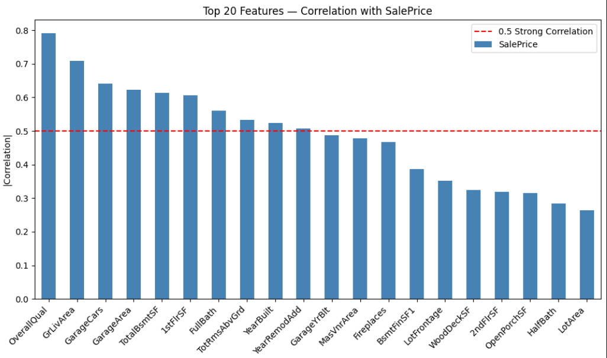
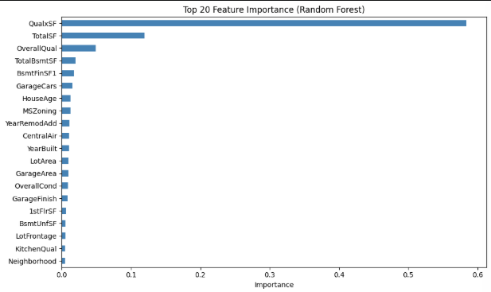
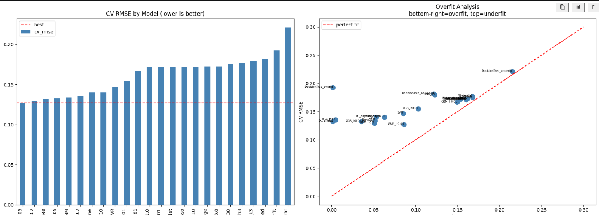

# House Prices Prediction

## Kaggle-ის კონკურსის მიმოხილვა
კონკურსის მიზანია ამერიკის ქალაქ Ames-ში სახლების გაყიდვის ფასების პრედიქცია 79 მახასიათებლის საფუძველზე. შეფასება ხდება RMSLE (Root Mean Squared Log Error) მეტრიკით.

## ჩემი მიდგომა
პრობლემის გადასაჭრელად გავიარე შემდეგი ეტაპები: EDA __ Cleaning __ Feature Engineering __ Feature Selection __ Training __ Tuning.

## რეპოზიტორიის სტრუქტურა
```
house-prices/
├── data/
│   ├── train.csv    
│   └── test.csv       
├── model_experiment.ipynb  
├── model_inference.ipynb   
├── submission.csv   
└── README.md
```

---

## Data Analysis

### SalePrice განაწილება
სახლების ფასები ძლიერ გადახრილია მარჯვნივ (skewness = 1.88). ეს ნიშნავს რომ ბევრი იაფი სახლია და ცოტა ძვირი. ეს კი პრობლემაა მოდელისთვის _ ძვირი სახლების ცდომილება ($500,000 vs $1,000,000) ბევრად დიდია ვიდრე იაფი სახლების, და მოდელი ამ დიდ ცდომილებების შემცირებას ცდილობს, სხვა სახლებს კი ივიწყებს.

ამის გამოსასწორებლად შეგვიძლია გამოვიყენოთ log1p ტრანსფორმაცია:
- skewness-ის ცვლილება 1.88 __ 0.12
- მოდელი log(SalePrice)-ზე ისწავლის
- პროგნოზის დროს expm1()-ს გამოვიყენებთ (log-ის საპირისპირო)
- ეს ასევე შეესაბამება Kaggle-ის RMSLE მეტრიკას


### Outlier ანალიზი
მონაცემტა ანალიზისას შემოწმდა მხოლოდ ის მახასიაბლები, რომელთაც არ ჰქონდათ ზედა ზღვარი(კატეგორიული ცვლადებსა და კონკრეტული რეინჯის მქონე ცვლადებს ამ ეტაპზე არ ვითვალისწინებთ), გამოვლინდა outlier-ები:
- **GrLivArea:** 2 სახლი >4000 sqft-ია მაგრამ დაბალი ფასი აქვს 
- **LotArea:** რამდენიმე სახლს ძალიან დიდი ეზო აქვს 
- **TotalBsmtSF:** ერთ სახლს >6000 sqft სარდაფი აქვს 

outlier-ები Mean-ს ამახინჯებს. მაგალითად თუ 10 სახლს $200,000 ღირს და ერთს $2,000,000, Mean გაიზრდება და არარეალური გახდება.  გამოვთვალეთ სად არის Mean და Median შორის დიდი სხვაობა __ ამ სვეტებში Median გამოვიყენეთ შევსებისთვის. გასათვალისწინებელია მონაცემთა კატეგორიულობაც. იმის გამო რომ მათ არ აქვთ რიცხვითი მნიშვნელობები, საჭირო იქნება რომ გამოვიყენოთ მოდა.

---

## Data Cleaning

### წასაშლელი სვეტები
`PoolQC` (99.5%), `MiscFeature` (96.3%), `Alley` (93.8%), `Fence` (80.7%) __ ამ სვეტებში მონაცემების 80-99% ცარიელია. Mode-ით ან Median-ით შევსება ყალბ ინფორმაციას შექმნის, ამიტომ ჯობს წავშალოთ. 

### დასკვნა:
დავდროფოთ უსარგებლო სვეტები(nan>80%), დანარჩენი შინაარსის შესაბამისად შევავსოთ მოდით/მედიანით და ა.შ
- 80%+ სვეტები წაიშლება.
- მედიანით შევსებამ შესაძლოა კონტექსტი არასწორად დააკავშიროს, ამიტომ: **LotFrontage** შეივსება Neighborhood-ის median-ით (და არა global median-ით). ერთი უბნის სახლებს მსგავსი ქუჩის სიგრძე აქვთ _ ეს გაცილებით რეალური დაშვებაა. დანარჩენი numeric __ median, categorical __ mode.
- მივიღებთ _ Shape (1460, 77), Missing values: 0


მივიღებთ _ Shape (1460, 80),
---

## Feature Engineering

### კატეგორიული ცვლადების რიცხვითში გადაყვანა

მონაცემებში 39 კატეგორიული სვეტია (ტექსტი). მოდელი ვერ მუშაობს ტექსტზე _ როცხვებში დამეპვა აუცილებელია.

#### Label Encoding
თითოეულ კატეგორიას მიენიჭება რიცხვი: `CollgCr=0`, `Veenker=1`, `Crawfor=2`
- მივიღებთ _ Shape (1460, 80)__სვეტების რაოდენობა არ შეიცვალა
- ეს მიდგომა ხის მოდელებისთვის კარგია. ხის მოდელი split-ებს ირჩევს (მაგ: Neighborhood > 5?), ამიტომ რიცხვების "სიდიდე" მნიშვნელობას არ ცვლის, ერთმანეთს ხელს არ უშლის.
- თუმცა შესაძლოა Linear მოდელებისთვის ცუდი იყოს, ვთქვათ თუ ერთი ცვლადის მნიშვნელოაბ მეორეზე 2-ჯერ მეტია შესაძლოა მან ეს რაიმე ლოგიკაში გაითვლისწინოს, თუმცა რეალურად ეს ცვლადებიარ არაა მსგავს დამოკიდებულებაში. 
- შეგვეძლო გვეცადა One-Hot Encoding, რომელიც წრფივი მოდელებისთვის უკეთესი იქნებოდა, თუმცა ვნახავთ, რომ ის ამატებს ძალიან დიდი რაოდენობით სვეტებს(80-დან 279-მდე), ეს ხმაურია მოდელისთვის და overfitting-ის რისკს ზრდის.

ამიტომ გამოვიყენებთ Label Encoding-ს.

### NaN მნიშვნელობების დამუშავება
აღწერილია Data Cleaning სექციაში ზემოთ.


### მახასიათებლების დამატება:
- ორიგინალ მონაცემებში ცალ-ცალკე გვაქვს სარდაფის, პირველი და მეორე სართულის ფართობები. მოდელისთვის კი უფრო მნიშვნელოვანია სახლის **სრული** ფართობი.
- ასევე ხარისხი × ფართობი პირდაპირ კავშირშია ფასთან.
- ვამატებთ სახლის ასაკსაც, მას გავლენა აქვს ფასზე. 
კორელაცია SalePrice-თან QualxSF-ს უფრო მაღალი აქვს ვიდრე თითოეულ ცვლად ცალ-ცალკე
---

## Feature Selection

ყველა feature თანაბრად სასარგებლო არ არის. უნდა შევამოწმოთ რომელია შედარებით მნიშვნელოვანი.

### ვარიანტი N1 __ ყველა Feature-ის შენარჩეუნება, თუმცა ზედმეტი ხმაური იქნება.

### ვარიანტი N2 __ Correlation Based Selection (25)
შეირჩა features,რომელთაც SalePrice-თან ჰქონდათ |კორელაცია| > 0.3.
- მივიღებთ 25 მახასიათებელს, რომელთაგანაც უპირატესები არიან `OverallQual`, `GrLivArea`, `GarageCars`, `ExterQual`, `GarageArea`
- **პრობლემა:** კორელაცია მხოლოდ **წრფივ** კავშირს ზომავს. თუ feature-ს SalePrice-თან არაწრფივი კავშირი აქვს, კორელაცია დაბალი იქნება, მაგრამ feature მაინც მნიშვნელოვანია


### ვარიანტი N3 __ Random Forest Importance top 15.
Random Forest მოდელით განვსაზღვრეთ რომელი feature რამდენად ამცირებს შეცდომას.
- მივიღებთ: `QualxSF`, `BsmtUnfSF`, `YearRemodAdd`, `GarageArea`, `MSZoning`, `LotArea`, `HouseAge`, `BsmtFinSF1`, `CentralAir`, `GrLivArea`, `OverallCond`, `TotalSF`, `1stFlrSF`, `GarageCars`, `GarageFinish`, `LotFrontage`, `YearBuilt`, `Neighborhood`, `SaleCondition`, `2ndFlrSF`
-შესამჩნევია, რომ ახალი features __ `QualxSF`, `HouseAge`, `TotalSF` _ top მახასიათებლებში მოხვდნენ!
- უკეთესია, რადგან მოდელზე დაფუძნებული შერჩევაა _ არაწრფივ კავშირებსაც ითვალისწინებს

| Features | CV RMSE |
|----------|---------|
| Top 10 | 0.1442 |
| Top 15 | 0.1408 |
| Top 20 | 0.1389 ✅ |
| Top 25 | 0.1399 |
| Top 30 | 0.1405 |


---

## Training

გავტესტე 24 სხვადასხვა მოდელი(ზოგი მეთოდი მეორდება თუმდა პარამეტრებია შეცვლილი) და კონფიგურაცია RF top features-ზე. ყველა run დავალოგე MLflow-ზე: `cv_rmse`, `train_rmse`, `cv_std`, `overfit_gap`.

**overfit_gap = cv_rmse - train_rmse:**
- დიდი gap _ overfit (მოდელი სასწავლო მონაცემებს იზეპირებს)
- პატარა gap-ია, მაგრამ cv_rmse მაღალია _ underfit (მოდელი ვერ სწავლობს)
- ბალანსი _ კარგი მოდელი

### Linear მოდელები _ Underfit
| მოდელი | CV RMSE | Train RMSE | Gap | დასკვნა |
|--------|---------|------------|-----|---------|
| Ridge (alpha=0.01) | 0.1717 | 0.1602 | 0.0115 | underfit |
| Ridge (alpha=1.0) | 0.1717 | 0.1602 | 0.0115 | underfit |
| Ridge (alpha=100) | 0.1727 | 0.1618 | 0.0109 | underfit, alpha დიდი __ უფრო underfit |
| Lasso | 0.1718 | 0.1603 | 0.0115 | underfit |
| ElasticNet | 0.1717 | 0.1602 | 0.0115 | underfit |
| BayesianRidge | 0.1723 | 0.1605 | 0.0118 | underfit |

**linear underfit:** სახლის ფასი და მახასიათებლები არაწრფივ კავშირშია. Linear მოდელები მხოლოდ წრფივ კავშირს ხედავს __ alpha-ს ცვლილებაც კი არ ეხმარება.

### Decision Tree __ Underfit-დან Overfit-მდე
| მოდელი | CV RMSE | Train RMSE | Gap | დასკვნა |
|--------|---------|------------|-----|---------|
| DecisionTree (depth=2) | 0.2213 | 0.2153 | 0.0061 | ძლიერი underfit |
| DecisionTree (depth=6) | 0.1814 | 0.1217 | 0.0596 | ბალანსი |
| DecisionTree (no limit) | 0.1925 | 0.0015 | 0.1910 | ძლიერი overfit |

**ეს ნათლად გვიჩვენებს depth-ის გავლენას:**
- depth=2: ზედმეტად მარტივი __ ვერ სწავლობს
- depth=6: ბალანსი __ გარკვეულ სიღრმეზე კარგია
- depth=None: იზეპირებს __ Train RMSE=0.0015 

### KNN __ k-ის გავლენა
| მოდელი | CV RMSE | Train RMSE | Gap | დასკვნა |
|--------|---------|------------|-----|---------|
| KNN (k=3) | 0.1796 | 0.1229 | 0.0568 | overfit __ მცირე k |
| KNN (k=10) | 0.1722 | 0.1538 | 0.0184 | ბალანსი |
| KNN (k=30) | 0.1753 | 0.1678 | 0.0075 | underfit __ დიდი k |

**k-ის გავლენა:** k=3 __ ახლო მეზობლები, ზედმეტად სპეციფიურია __ overfit. k=30 __ ბევრი მეზობელი, ზედმეტად ზოგადია __ underfit.

### Random Forest __ depth-ის გავლენა
| მოდელი | CV RMSE | Train RMSE | Gap | დასკვნა |
|--------|---------|------------|-----|---------|
| RF (depth=3) | 0.1769 | 0.1679 | 0.0090 | underfit |
| RF (depth=10) | 0.1401 | 0.0630 | 0.0771 | ზომიერი overfit |
| RF (depth=None) | 0.1399 | 0.0531 | 0.0868 | overfit |
| ExtraTrees | 0.1323 | 0.0015 | 0.1308 | ძლიერი overfit |

**depth=3:** ხე ძალიან მოკლეა, ვერ სწავლობს. **depth=None:** Train RMSE=0.05 __ ზეპირად იმახსოვრებს.

### GradientBoosting __ learning_rate-ის გავლენა
| მოდელი | CV RMSE | Train RMSE | Gap | დასკვნა |
|--------|---------|------------|-----|---------|
| GBM (lr=0.01) | 0.1666 | 0.1496 | 0.0170 | underfit __ ნელი სწავლება |
| GBM (lr=0.05) | 0.1270 | 0.0861 | 0.0409 | ✅ საუკეთესო |
| GBM (lr=0.2) | 0.1296 | 0.0508 | 0.0787 | overfit __ სწრაფი სწავლება |

**learning_rate-ის გავლენა:** lr=0.01 ძალიან ნელა სწავლობს (underfit). lr=0.2 ძალიან სწრაფად სწავლობს და იზეპირებს (overfit). lr=0.05 __ ოპტიმალურია.

### XGBoost __ learning_rate-ის გავლენა
| მოდელი | CV RMSE | Train RMSE | Gap | დასკვნა |
|--------|---------|------------|-----|---------|
| XGB (lr=0.01) | 0.1548 | 0.1032 | 0.0515 | underfit |
| XGB (lr=0.05) | 0.1325 | 0.0355 | 0.0970 | overfit |
| XGB (lr=0.2) | 0.1353 | 0.0047 | 0.1306 | ძლიერი overfit |

### სხვა მოდელები
| მოდელი | CV RMSE | Train RMSE | Gap | დასკვნა |
|--------|---------|------------|-----|---------|
| SVR | 0.1467 | 0.0851 | 0.0616 | ზომიერი |
| LightGBM | 0.1338 | 0.0519 | 0.0819 | overfit |

### საუკეთესო 5 მოდელი
| მოდელი | CV RMSE | Train RMSE | Gap |
|--------|---------|------------|-----|
| **GBM_lr0.05** | **0.1270** | 0.0861 | 0.0409 |
| GBM_lr0.2 | 0.1296 | 0.0508 | 0.0787 |
| ExtraTrees | 0.1323 | 0.0015 | 0.1308 |
| XGB_lr0.05 | 0.1325 | 0.0355 | 0.0970 |
| LightGBM | 0.1338 | 0.0519 | 0.0819 |

**რატომ GBM_lr0.05:** ExtraTrees CV RMSE=0.1323-ია, მაგრამ Gap=0.1308 __ ძლიერი overfit-ია. GBM_lr0.05-ს კი CV RMSE=0.1270 და Gap=0.0409 __ ბალანსი შენარჩუნებულია.

---

## Hyperparameter Tuning

GradientBoosting-ზე გავატარე GridSearchCV 27 კომბინაციით (5-fold = 135 fit):
n_estimators: [100, 200, 300]
learning_rate: [0.01, 0.05, 0.1]
max_depth: [3, 4, 5]
 

---

**საუკეთესო პარამეტრები:** n_estimators=300, learning_rate=0.05, max_depth=3

**შედეგი:** CV RMSE გაუმჯობესდა 0.1270 __ **0.1264**

### საბოლოო მოდელის შერჩევის დასაბუთება
**GradientBoosting (tuned)** შეირჩა რადგან:
1. ყველაზე დაბალი CV RMSE: **0.1264**
2. Gap გონივრულია: **0.0486** __ არ არის overfit
3. learning_rate=0.05 ოპტიმალური სიჩქარეა __ არ ჩქარობს, არ ახდება
4. n_estimators=300 საკმარისი iteration-ია სრული სწავლებისთვის
5. max_depth=3 __ ხე არ ღრმავდება ზედმეტად, overfitting-ს ებრძვის
 
 
## MLflow Tracking
 
### MLflow ექსპერიმენტების ბმული
[https://dagshub.com/aband22/house-prices.mlflow](https://dagshub.com/aband22/house-prices.mlflow)
 
### ჩაწერილი მეტრიკები თითოეული run-ისთვის
- `cv_rmse` __ cross-validation RMSE (5-fold) __ მთავარი მეტრიკა
- `cv_std` __ CV RMSE-ის სტანდარტული გადახრა (სტაბილურობის მაჩვენებელი)
- `train_rmse` __ სასწავლო მონაცემებზე RMSE
- `overfit_gap` __ cv_rmse - train_rmse (overfitting-ის მაჩვენებელი)
 


 